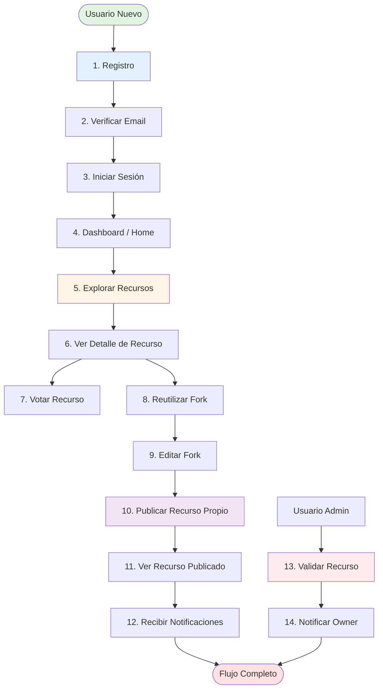
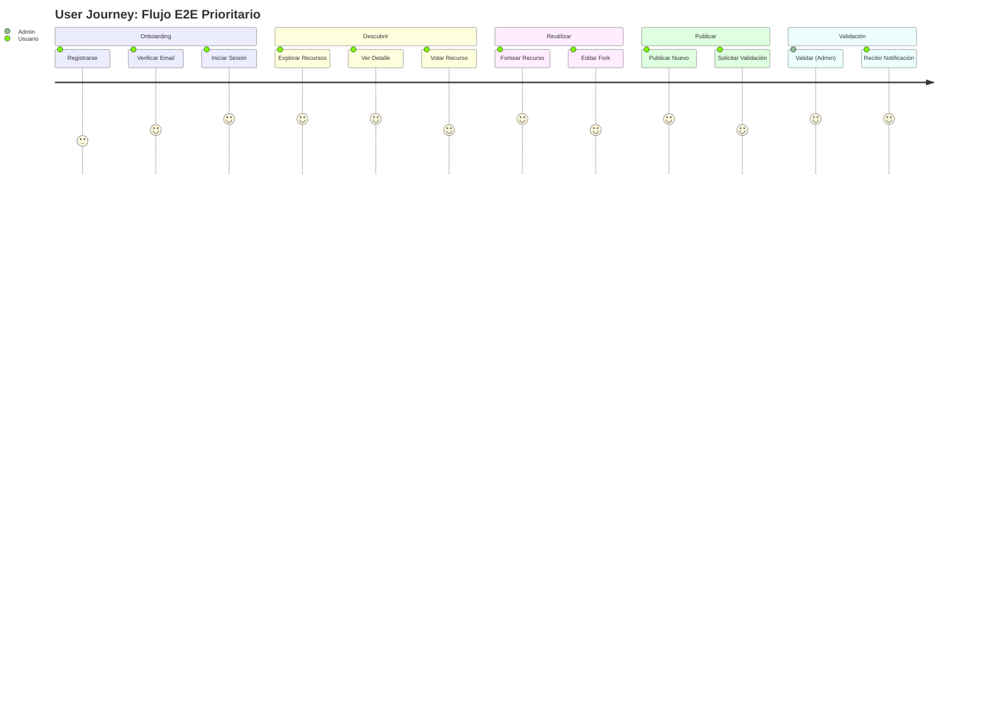

# E2E PRIORITY FLOW — BioAI Hub

**Proyecto:** BioAI Hub — Institutional AI Repository  
**Dominio:** bioai.ccg.unam.mx  
**Versión:** 1.0  
**Fecha:** 2026-02-16  
**Objetivo:** Definir el flujo End-to-End prioritario que genera valor completo en el MVP

---

## 1. FLUJO E2E PRIORITARIO (MVP)

**Descripción:** El flujo principal que un usuario debe poder completar de principio a fin para experimentar el valor completo de la plataforma.

**Usuario tipo:** Investigador/Estudiante CCG que busca publicar y reutilizar un recurso de IA validado por la comunidad.

---

## 2. FLUJO COMPLETO (PASO A PASO)

---

## 3. DETALLE DE CADA PASO

### PASO 1: Registro

**Pantalla:** `/register`  
**Figma:** (No en diseños actuales, flujo de autenticación común)  
**Rol:** Usuario Anónimo

**Acciones:**
1. Usuario accede a Home (`/`)
2. Hace clic en "Sign Up" / "Registrarse"
3. Completa formulario:
   - Email (cualquier dominio)
   - Nombre completo
   - Contraseña (min 8 chars, 1 mayúscula, 1 número)
4. Acepta términos y condiciones
5. Click en "Registrarse"

**Resultado:**
- Sistema crea usuario con `email_verified_at = NULL`
- Envía email de verificación con token
- Redirige a pantalla "Verifica tu email"

**Valor:** Usuario puede crear cuenta sin restricción institucional.

---

### PASO 2: Verificar Email

**Pantalla:** `/auth/verify-email/:token` (landing page post-click)  
**Rol:** Usuario Registrado No Verificado

**Acciones:**
1. Usuario revisa su correo
2. Hace clic en link de verificación
3. Sistema valida token (no expirado, no usado)
4. Actualiza `user.email_verified_at = now()`
5. Redirige a `/login` con mensaje "Email verificado, inicia sesión"

**Resultado:**
- Usuario puede publicar recursos

**Valor:** Seguridad contra spam y bots.

---

### PASO 3: Iniciar Sesión

**Pantalla:** `/login`  
**Rol:** Usuario Verificado

**Acciones:**
1. Usuario ingresa email + contraseña
2. Sistema valida credenciales
3. Genera JWT (access token)
4. Redirige a `/` (home autenticado) o intended route

**Resultado:**
- Usuario autenticado, sesión activa

**Valor:** Acceso a features protegidas.

---

### PASO 4: Dashboard / Home Autenticado

**Pantalla:** `/` (versión autenticada)  
**Figma:** `home.png` (versión adaptada con sidebar)  
**Rol:** Usuario Autenticado

**Elementos visibles:**
- Sidebar con navegación: Explore, Publish, Profile, Notifications
- Featured resources (destacados)
- CTA: "Publish New Resource"
- Métricas personales: recursos publicados, votos recibidos

**Acciones:**
- Usuario ve bienvenida personalizada
- Click en "Explore Resources" → `/explore`

**Valor:** Orientación inicial, acceso rápido a funciones principales.

---

### PASO 5: Explorar Recursos

**Pantalla:** `/explore`  
**Figma:** `explore.png`  
**Rol:** Usuario Autenticado (o Anónimo)

**Acciones:**
1. Usuario navega catálogo de recursos
2. Aplica filtros:
   - Tipo: Prompt, Workflow, Notebook
   - Estado: Validated (para ver solo verificados)
   - Tags: bioinformática, RNA-seq, etc.
3. Busca por palabra clave: "protein folding"
4. Ve resultados paginados (20 por página)

**Resultado:**
- Lista de recursos relevantes
- Cada tarjeta muestra: título, autor, badge Validated, votos, usos

**Valor:** Descubrir recursos de calidad rápidamente.

---

### PASO 6: Ver Detalle de Recurso

**Pantalla:** `/resources/:id`  
**Figma:** `resource-detail.png`  
**Rol:** Usuario Autenticado

**Información visible:**
- Título, descripción completa (markdown)
- Autor (link a perfil)
- Badge: Validated
- PID: `ccg-ai:R-000042@v1.0.0`
- Tags completos
- Métricas: 25 votos, 120 usos, 5 forks
- Botones: Upvote, Reuse, Share
- Sección: Instrucciones, Ejemplo, Historial de Versiones

**Acciones:**
- Usuario lee descripción
- Ve que tiene badge Validated → confianza en calidad
- Decide: votar o reutilizar

**Valor:** Información completa para tomar decisión de uso.

---

### PASO 7: Votar Recurso

**Pantalla:** `/resources/:id` (mismo detalle)  
**Rol:** Usuario Autenticado

**Acciones:**
1. Usuario hace clic en botón "Upvote" (icono corazón/star)
2. Sistema registra voto (toggle, puede deshacer)
3. Contador incrementa visualmente: 25 → 26
4. Notificación toast: "Voto registrado"

**Resultado:**
- Recurso tiene +1 voto (acercándose a criterio de validación automática)
- Owner del recurso recibe notificación (opcional MVP)

**Valor:** Reconocimiento comunitario, señal de calidad.

---

### PASO 8: Reutilizar (Fork)

**Pantalla:** `/resources/:id` (detalle) → `/resources/:newId/edit`  
**Rol:** Usuario Autenticado

**Acciones:**
1. Usuario hace clic en "Reuse This Resource"
2. Sistema crea nuevo recurso:
   - Owner = usuario actual
   - Derived from = recurso original
   - Contenido copiado (versión latest)
3. Redirige a `/resources/:newId/edit` con banner:
   - "Recurso reutilizado exitosamente. Edítalo y publícalo."

**Resultado:**
- Nuevo recurso en estado Sandbox
- Usuario puede editarlo libremente

**Valor:** Reutilización rápida sin partir de cero, trazabilidad de derivaciones.

---

### PASO 9: Editar Fork

**Pantalla:** `/resources/:newId/edit`  
**Rol:** Usuario Autenticado (Owner del fork)

**Acciones:**
1. Usuario modifica:
   - Título: "Protein Folding Prompt (Extended)"
   - Descripción: agrega contexto específico de su caso de uso
   - Tags: agrega "AlphaFold"
   - Contenido: ajusta instrucciones
2. Mantiene source_type = Internal
3. Click en "Save Changes"

**Resultado:**
- Versión actualizada (v1.0.0 del nuevo recurso)
- Status sigue siendo Sandbox

**Valor:** Personalización para caso de uso específico.

---

### PASO 10: Publicar Recurso Propio (Nuevo desde Cero)

**Pantalla:** `/publish`  
**Figma:** `publish.png`  
**Rol:** Usuario Autenticado

**Acciones:**
1. Usuario hace clic en "Publish New Resource" (desde sidebar o dashboard)
2. Completa formulario:
   - Título: "RNA-seq Analysis Workflow"
   - Descripción: pasos detallados + herramientas
   - Tipo: Workflow
   - Source type: GitHub-linked
   - Repo URL: `https://github.com/user/rna-seq-workflow`
   - Tag: `v1.2.0`
   - License: MIT
   - Tags: RNA-seq, bioinformática, transcriptómica
   - Status inicial: Request Validation
3. Click en "Publish"

**Resultado:**
- Nuevo recurso creado con ResourceVersion v1.0.0
- Status = Pending Validation
- Notificación enviada a Admins: "Nueva solicitud de validación"
- Redirige a `/resources/:id` con toast: "Recurso publicado. Solicitud de validación enviada."

**Valor:** Publicación profesional con trazabilidad y posibilidad de validación institucional.

---

### PASO 11: Ver Recurso Publicado (Propio)

**Pantalla:** `/resources/:id` (recurso propio)  
**Rol:** Usuario Autenticado (Owner)

**Diferencias vs usuario no-owner:**
- Botones adicionales: Edit, Delete
- Badge: Pending Validation (amarillo)
- Métricas iniciales: 0 votos, 0 usos

**Acciones:**
- Usuario ve su recurso publicado
- Comparte link con colegas CCG
- Espera feedback (votos) o validación admin

**Valor:** Visibilidad inmediata, posibilidad de iterar.

---

### PASO 12: Recibir Notificaciones

**Pantalla:** `/notifications` (campana en navbar)  
**Rol:** Usuario Autenticado

**Escenarios:**

#### Escenario A: Recurso Validado (Automático)
Después de 2+ semanas, si el recurso alcanza:
- ≥10 votos
- ≥50 usos
- 0 reportes

Sistema promociona automáticamente:
- `status = Validated`
- Crea notificación: "Tu recurso 'RNA-seq Analysis Workflow' ha sido validado automáticamente"
- Badge cambia a Validated (verde)

**Valor:** Reconocimiento institucional basado en evidencia comunitaria.

---

#### Escenario B: Recurso Validado (Manual por Admin)
Admin revisa recurso con `Pending Validation`:

**Flujo Admin (PASO 13):**

---

### PASO 13: Validar Recurso (Admin)

**Pantalla:** `/resources/:id` (vista Admin)  
**Rol:** Admin

**Acciones:**
1. Admin ve recurso con badge "Pending Validation"
2. Revisa calidad: descripción completa, ejemplo válido, enlace GitHub funcional
3. Hace clic en "Validate" (botón visible solo para Admin)
4. Modal de confirmación: "¿Validar este recurso?"
5. Click en "Confirm"

**Resultado:**
- `status = Validated`, `validated_at = now()`
- Badge cambia a Validated
- Sistema crea notificación para owner

**Valor:** Validación humana rápida cuando comunidad aún es pequeña.

---

### PASO 14: Notificar Owner

**Sistema:** Notificación in-app  
**Rol:** Sistema → Usuario Owner

**Contenido notificación:**
- Tipo: ResourceValidated
- Mensaje: "Tu recurso 'RNA-seq Analysis Workflow' ha sido validado por un administrador"
- Link: `/resources/:id`
- Timestamp: hace 2 minutos
- Estado: unread

**Acciones del Owner:**
1. Ve badge rojo en campana de notificaciones (1 nueva)
2. Click en campana → abre panel de notificaciones
3. Lee notificación
4. Click en notificación → redirige a `/resources/:id`
5. Ve badge Validated en su recurso
6. Puede compartir con orgullo el PID institucional

**Valor:** Feedback loop cerrado, reconocimiento institucional tangible.

---

## 4. VALOR COMPLETO DEL FLUJO E2E

Al completar este flujo, el usuario ha experimentado:

1. ✅ **Registro e identidad:** Cuenta verificada y segura
2. ✅ **Descubrimiento:** Explorar recursos de calidad (Validated)
3. ✅ **Participación:** Votar para contribuir a la calidad
4. ✅ **Reutilización:** Fork rápido con trazabilidad
5. ✅ **Publicación:** Publicar recurso propio con profesionalismo
6. ✅ **Validación:** Solicitar y recibir validación institucional
7. ✅ **Reconocimiento:** Notificaciones de validación y métricas
8. ✅ **Trazabilidad:** PID tipo DOI para citación

**Resultado:** Ciclo completo de colaboración científica digital con gobernanza institucional.

---

## 5. PANTALLAS INVOLUCRADAS (MAPEO FIGMA)

| Paso | Pantalla | Figma | Notas |
|---|---|---|---|
| 1-3 | Auth (Register/Login) | No en Figma actual | Flujo estándar, puede usar templates |
| 4 | Home Autenticado | `home.png` | Adaptar con sidebar |
| 5 | Explore | `explore.png` | ✅ Diseñado |
| 6 | Resource Detail | `resource-detail.png` | ✅ Diseñado |
| 10 | Publish | `publish.png` | ✅ Diseñado |
| 11 | Profile (Own) | `profile.png` | ✅ Diseñado |
| 12 | Notifications | No en Figma actual | Puede ser modal/panel desplegable |

**Gap identificado:** Pantallas de Auth y Notifications no tienen diseño Figma. Recomendación: usar componentes estándar de Next.js Auth templates.

---

## 6. HISTORIAS MUST-HAVE QUE CUBREN ESTE FLUJO

El flujo E2E se compone de estas historias (a definir en EPICS_AND_STORIES.md):

1. **US-01:** Como usuario nuevo, quiero registrarme y verificar mi email para poder publicar recursos
2. **US-02:** Como usuario autenticado, quiero explorar recursos con filtros para encontrar lo que necesito
3. **US-03:** Como usuario autenticado, quiero ver el detalle completo de un recurso para evaluar su calidad
4. **US-04:** Como usuario autenticado, quiero votar recursos para reconocer su valor
5. **US-05:** Como usuario autenticado, quiero reutilizar (fork) un recurso para adaptarlo a mi caso
6. **US-06:** Como usuario autenticado, quiero publicar un nuevo recurso para compartirlo con la comunidad
7. **US-07:** Como Admin, quiero validar recursos para garantizar calidad institucional
8. **US-08:** Como usuario, quiero recibir notificaciones de validación para saber el estado de mis recursos

---

## 7. ACTORES PRINCIPALES

| Actor | Rol | Participación en Flujo |
|---|---|---|
| **Usuario Nuevo** | Registro | Pasos 1-3 |
| **Usuario Autenticado** | Explorador, Voter, Forker, Publisher | Pasos 4-12 |
| **Owner** | Creador de recurso | Pasos 10-11 |
| **Admin** | Validador | Pasos 13-14 |
| **Sistema** | Automatización | Notificaciones, promoción automática |

---

## 8. FLUJOS ALTERNATIVOS (SHOULD-HAVE)

Estos flujos complementan el principal pero no son críticos para MVP:

### A) Editar Recurso Propio
- Owner modifica recurso después de publicar
- Si última versión Validated → crea nueva versión (vNext)

### B) Eliminar Recurso Propio
- Owner decide retirar recurso
- Soft delete (auditoría)

### C) Historial de Versiones
- Usuario navega versiones previas
- Ve changelog entre versiones

### D) Reportar Recurso
- Usuario reporta contenido inapropiado/erróneo
- Admin gestiona reporte

### E) Perfil Público de Otro Usuario
- Usuario ve métricas de contribución de otro investigador
- Link a sus recursos publicados

---

## 9. DIAGRAMA DE FLUJO SIMPLIFICADO (USER JOURNEY)

**Escala de satisfacción:** 1 (frustración) a 5 (excelente)

---

## 10. MÉTRICAS DE ÉXITO DEL FLUJO E2E

Para validar que el flujo funciona correctamente:

| Métrica | Objetivo MVP | Cómo medir |
|---|---|---|
| **Tasa de completitud** | ≥60% usuarios completan flujo completo | Analytics: funnel registro → publicación |
| **Tiempo promedio** | <15 minutos (primera publicación) | Analytics: timestamp entre pasos |
| **Tasa de conversión** | ≥40% usuarios verificados publican | % verificados que crean ≥1 recurso |
| **Satisfacción** | ≥4/5 en encuesta post-flujo | Encuesta post-publicación |
| **Recursos reutilizados** | ≥20% recursos tienen ≥1 fork | % recursos con forks_count > 0 |

---

## 11. RIESGOS DEL FLUJO E2E

| Riesgo | Probabilidad | Impacto | Mitigación |
|---|---|---|---|
| Usuario no verifica email | Media | Medio | Reminder email a 24h, UI warning visible |
| Usuario abandona en Explore | Media | Bajo | Empty state atractivo, featured resources |
| Formulario de Publish complejo | Media | Alto | Wizard con pasos claros, tooltips, preview |
| Demora en validación manual | Alta | Medio | Promoción automática paralela, SLA admin |
| Falta de recursos iniciales | Alta | Alto | Seed data con 10-15 recursos de calidad |

---

## 12. DEPENDENCIAS TÉCNICAS CRÍTICAS

Para que el flujo E2E funcione:

### Backend:
- ✅ API Auth completa (`/auth/*`)
- ✅ API Resources (`/resources/*`)
- ✅ API Votes (`/resources/:id/vote`)
- ✅ API Fork (`/resources/:id/fork`)
- ✅ API Notifications (`/notifications`)
- ✅ Job cron para promoción automática

### Frontend:
- ✅ Páginas: Register, Login, Explore, Resource Detail, Publish, Notifications
- ✅ Componentes: ResourceCard, VoteButton, Badge (Sandbox/Validated), NotificationPanel
- ✅ State management: auth state, notifications state

### Infraestructura:
- ✅ SMTP para emails (verificación)
- ✅ PostgreSQL con migraciones
- ✅ Job scheduler (cron)

---

## 13. CRITERIOS DE ACEPTACIÓN GLOBAL DEL FLUJO E2E

El flujo E2E se considera **completo y funcional** cuando:

1. ✅ Usuario puede registrarse, verificar email, y login sin errores
2. ✅ Usuario puede explorar ≥10 recursos con filtros funcionales
3. ✅ Usuario puede ver detalle completo de recurso (badge, métricas, PID)
4. ✅ Usuario puede votar recurso (toggle funcional)
5. ✅ Usuario puede forkear recurso y editar fork
6. ✅ Usuario puede publicar nuevo recurso con GitHub-linked
7. ✅ Admin puede validar recurso manualmente
8. ✅ Usuario recibe notificación de validación in-app
9. ✅ Recurso con criterios cumplidos se promociona automáticamente (job cron)
10. ✅ Tests E2E pasan 100% para flujo completo (Playwright/Cypress)

---

## 14. SIGUIENTE PASO

Este flujo E2E prioritario alimenta directamente:
- **EPICS_AND_STORIES.md:** Historias Must-Have que implementan cada paso
- **UI_STATES.md:** Estados UI por pantalla (loading, error, success, empty)
- **TEST_STRATEGY.md:** E2E test plan para el flujo principal

---

**Documento completado:** 2026-02-16  
**Siguiente artefacto:** EPICS_AND_STORIES.md  
**Rol siguiente:** PM + UX Analyst
