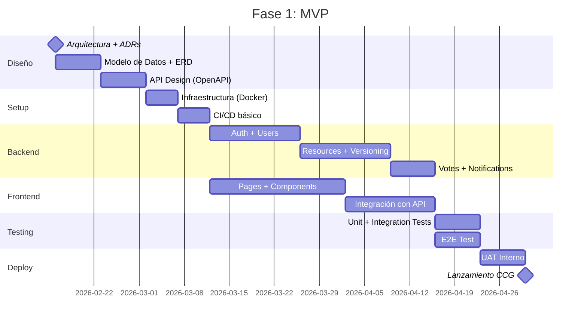
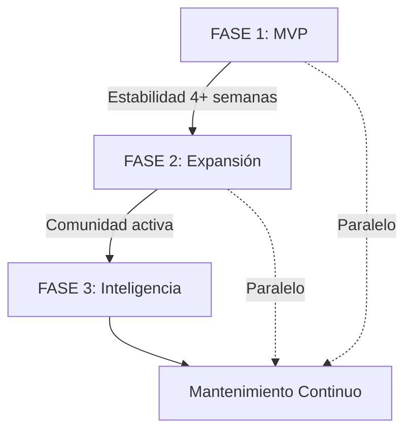

# ROADMAP — BioAI Hub

**Proyecto:** BioAI Hub — Institutional AI Repository  
**Dominio:** bioai.ccg.unam.mx  
**Versión:** 1.0  
**Fecha:** 2026-02-16  
**Estrategia:** Evolutiva por fases (MVP → Expansión → Inteligencia)

---

## VISIÓN GENERAL

BioAI Hub evoluciona de una plataforma institucional interna (CCG) hacia un repositorio público de recursos de IA aplicada a bioinformática, con capacidades avanzadas de recomendación, búsqueda semántica y API pública.

**Principio:** Entregar valor incremental en cada fase, evitando sobreingeniería.

---

## FASE 1: MVP — CORE PLATFORM

**Objetivo:** Plataforma funcional con flujo E2E completo para usuarios CCG

**Duración estimada:** 12-16 semanas (sin timelines fijas, depende de recursos)

### Criterios de Entrada:
- ✅ PRD refinado completado
- ✅ Arquitectura y modelo de datos diseñados
- ✅ Épicas e historias Must-Have definidas
- ✅ Stack tecnológico validado

### Features Core:

#### Autenticación y Usuarios
- Registro con cualquier email + verificación obligatoria
- Login/logout con JWT
- Recuperación de contraseña
- Roles: Admin y User
- Perfil público con métricas de reputación

#### Catálogo de Recursos
- Explorar recursos (público, sin login)
- Búsqueda textual (título + descripción)
- Filtros: tipo, estado (Sandbox/Validated), source type, tags
- Paginación (20 items por página)
- Vista de tarjeta (card) con métricas resumidas

#### Publicación y Versionado
- Publicar recurso (formulario)
- Versionado híbrido:
  - Internal: contenido almacenado en plataforma
  - GitHub-linked: enlace a repositorio externo
- Identificador persistente tipo DOI: `ccg-ai:R-000123@v1.0.0`
- Versionado automático al editar recurso validado
- Inmutabilidad de versiones validadas

#### Validación y Calidad
- Modelo Sandbox / Validated
- Promoción automática (criterios: ≥10 votos, ≥50 usos, ≥2 semanas, 0 reportes)
- Validación manual por Admin
- Revocar validación (Admin)

#### Interacciones Comunitarias
- Sistema de votos (1 por usuario por recurso, toggle)
- Reutilización (fork) con trazabilidad bidireccional
- Notificaciones in-app (recurso validado, forked, validación revocada)

#### Administración
- Panel Admin: validar recursos, gestionar usuarios
- Logs de auditoría para acciones críticas

### Criterios de Salida (Definition of Done):

#### Funcionales:
- ✅ Flujo E2E navegable: Registro → Explorar → Publicar → Validar → Reutilizar
- ✅ Al menos 10 usuarios reales registrados y activos
- ✅ Al menos 15 recursos publicados (mix de Internal y GitHub-linked)
- ✅ Al menos 3 recursos reutilizados (fork)
- ✅ Al menos 2 recursos promovidos a Validated (automático o manual)
- ✅ Notificaciones funcionando (in-app)

#### Técnicos:
- ✅ Tests automatizados (unit + integration) con cobertura ≥70%
- ✅ Al menos 1 test E2E del flujo principal
- ✅ CI/CD funcional (lint + tests + deploy)
- ✅ Plataforma desplegada en bioai.ccg.unam.mx (HTTPS)
- ✅ Documentación técnica completa (`/docs`)
- ✅ Backups automáticos de BD (diarios)

#### Negocio:
- ✅ Presentación interna en CCG (seminario/curso)
- ✅ Feedback cualitativo de 5+ usuarios early adopters
- ✅ Métricas iniciales capturadas (recursos, usuarios, votos)

### Hitos Principales:

### Riesgos Fase 1:
- **Baja adopción inicial:** Mitigación → presentaciones, incentivos
- **Complejidad técnica subestimada:** Mitigación → spikes tempranos, refinamiento continuo
- **Falta de recursos CCG:** Mitigación → priorizar historias Must-Have, posponer Should-Have

---

## FASE 2: EXPANSIÓN — UX Y FEATURES SECUNDARIAS

**Objetivo:** Mejorar experiencia de usuario y completar features secundarias

**Duración estimada:** 8-12 semanas

**Precondición:** Fase 1 completada y en producción estable (≥4 semanas sin issues críticos)

### Features:

#### Notificaciones Mejoradas
- Notificaciones por email (instantáneo o daily digest)
- Configuración de preferencias de notificación por usuario
- Templates HTML profesionales

#### Historial de Versiones Avanzado
- Página dedicada: `/resources/:id/versions`
- Comparación visual entre versiones (diff)
- Changelog obligatorio al crear nueva versión
- Revertir a versión anterior (opcional, evaluar complejidad)

#### Sistema de Reportes Completo
- Reportar recurso (razón: inapropiado, error, spam, plagio)
- Panel Admin: gestionar reportes (resolver, rechazar, tomar acción)
- Contador de reportes críticos (impacta promoción automática)

#### Métricas y Analytics
- Dashboard para owners: métricas detalladas de sus recursos
  - Views por día/semana/mes
  - Forks timeline
  - Votos acumulados
  - Tráfico de referencia
- Métricas globales (Admin): usuarios activos, recursos por tipo, engagement

#### Búsqueda Avanzada
- Filtros combinados (múltiples tipos, tags, rangos de fecha)
- Ordenamiento: más votados, más usados, más recientes, alfabético
- Guardar búsquedas favoritas (opcional)

#### Exportar/Importar Recursos
- Exportar recurso a JSON/YAML (para backup o migración)
- Importar desde JSON/YAML (batch upload para admins)

#### Mejoras UX
- Avatars custom (upload de imagen)
- Dark mode
- Shortcuts de teclado (navegación rápida)
- Tour guiado para nuevos usuarios

### Criterios de Salida Fase 2:
- ✅ Notificaciones email funcionando
- ✅ Sistema de reportes en uso (al menos 5 reportes gestionados)
- ✅ Comparación de versiones disponible
- ✅ Analytics dashboard accesible para owners
- ✅ Feedback positivo de usuarios sobre mejoras UX

### Métricas de Éxito Fase 2:
- ≥30 usuarios activos mensuales
- ≥100 recursos publicados
- ≥30% recursos Validated
- ≥50% usuarios configuran notificaciones email
- ≥10 reportes gestionados sin escalamiento

---

## FASE 3: INTELIGENCIA — IA Y APERTURA PÚBLICA

**Objetivo:** Capacidades avanzadas de IA y apertura a comunidad científica externa

**Duración estimada:** 12+ semanas

**Precondición:** Fase 2 completada, plataforma estable, comunidad CCG activa

### Features:

#### Recomendador Basado en IA
- Recomendaciones personalizadas basadas en:
  - Historial de visualización
  - Votos y forks previos
  - Tags de interés (inferidos o declarados)
- Algoritmo: Collaborative filtering + Content-based
- Sección "Recursos recomendados para ti" en dashboard

#### Búsqueda Semántica
- Embeddings de recursos (título + descripción + tags)
- Búsqueda por similitud semántica (no solo keywords)
- Tecnología: OpenAI Embeddings, Sentence Transformers, o similar
- Cluster de recursos relacionados (visualización)

#### API Pública
- REST API documentada (OpenAPI v3)
- GraphQL (opcional, evaluar demanda)
- Rate limiting estricto (API keys)
- Documentación interactiva (Swagger UI)
- SDKs oficiales (Python, JavaScript)

#### Apertura Pública
- Registro abierto sin restricción institucional
- Moderación comunitaria (reportes, votación de calidad)
- Roles adicionales:
  - Reviewer: puede validar recursos (peer review)
  - Moderator: gestiona reportes, pero no edita recursos
- Métricas públicas agregadas (total recursos, usuarios, stats)

#### Integración con Jupyter Hub
- Ejecutar notebooks directamente en plataforma (sandbox)
- Tecnología: JupyterHub, BinderHub, o similar
- Limitaciones de recursos (CPU, RAM, tiempo)
- Link "Run in JupyterHub" en recursos tipo Notebook

#### DOI Real
- Integración con DataCite o Crossref
- Asignar DOI real a recursos Validated
- Citación formal para publicaciones académicas
- Formato: `10.XXXXX/ccg.bioai.R-000123.v1.0.0`

#### Features Avanzadas Opcionales
- Colecciones / Playlists (agrupar recursos relacionados)
- Recursos privados (visibilidad: public, unlisted, private)
- Co-autoría (múltiples owners por recurso)
- Integración con ORCID (identidad científica)
- Mirror automático a GitHub (sincronización bidireccional)

### Criterios de Salida Fase 3:
- ✅ Recomendador funcionando con precisión >60%
- ✅ Búsqueda semántica más relevante que búsqueda textual (A/B test)
- ✅ API pública con ≥3 consumers externos
- ✅ Al menos 5 recursos con DOI real asignado
- ✅ Jupyter Hub integrado con ≥10 notebooks ejecutados
- ✅ Comunidad externa activa (≥50 usuarios no-CCG)

### Métricas de Éxito Fase 3:
- ≥200 usuarios activos mensuales (50% externos)
- ≥500 recursos publicados
- ≥100 requests/día a API pública
- ≥20 DOIs asignados
- Citación en al menos 2 papers académicos

---

## POST-FASE 3: MANTENIMIENTO Y EVOLUCIÓN CONTINUA

### Áreas de evolución perpetua:
- **Seguridad:** Auditorías, actualizaciones de dependencias, pentesting
- **Performance:** Optimización de queries, CDN, caching
- **Escalabilidad:** Migración a microservicios si crece demanda
- **UX:** Mejoras basadas en feedback continuo
- **Inteligencia:** Modelos de ML más sofisticados (LLMs para sugerencias de mejora)

---

## DEPENDENCIAS ENTRE FASES

**Regla:** No avanzar a siguiente fase sin completar criterios de salida de fase anterior.

---

## HITOS CRÍTICOS (MILESTONES)

| Milestone | Descripción | Criterio de Éxito | Fase |
|---|---|---|---|
| **M1: Diseño Completo** | Arquitectura + Datos + API diseñados | Docs completas + revisión aprobada | 1 |
| **M2: Backend Funcional** | API REST completa con tests | Tests pasando + coverage ≥70% | 1 |
| **M3: Frontend Navegable** | UI completa con flujo E2E | E2E test pasando | 1 |
| **M4: Lanzamiento Interno** | Deploy en producción CCG | ≥10 usuarios, ≥15 recursos | 1 |
| **M5: Notificaciones Email** | Sistema de email operativo | ≥50% usuarios configuran email | 2 |
| **M6: Sistema de Reportes** | Moderación activa | ≥10 reportes gestionados | 2 |
| **M7: API Pública** | API REST documentada y estable | ≥3 consumers externos | 3 |
| **M8: DOI Real** | Integración DataCite | ≥5 DOIs asignados | 3 |
| **M9: Apertura Pública** | Registro abierto, comunidad externa | ≥50 usuarios no-CCG | 3 |

---

## DECISIONES DE PRIORIZACIÓN

### Must-Have (Fase 1):
- Autenticación y usuarios
- Explorar y publicar recursos
- Versionado y validación
- Votos y forks
- Notificaciones in-app

### Should-Have (Fase 2):
- Notificaciones email
- Historial de versiones avanzado
- Sistema de reportes completo
- Analytics dashboard

### Could-Have (Fase 3):
- Recomendador IA
- Búsqueda semántica
- API pública
- Jupyter Hub
- DOI real

### Won't-Have (Por ahora):
- Microservicios
- Blockchain / Web3
- Ejecución de código arbitrario sin sandbox
- Monetización / Marketplace
- Integración con LMS (Moodle, Canvas)

---

## RECURSOS REQUERIDOS (ESTIMACIÓN)

### Fase 1:
- **Dev Team:** 2 full-time (1 backend, 1 frontend) o 1 full-stack
- **Product/UX:** 0.5 FTE (part-time)
- **DevOps:** 0.25 FTE (setup inicial)
- **QA:** 0.5 FTE (testing)
- **Total effort:** ~800-1000 horas

### Fase 2:
- **Dev Team:** 1-2 FTE
- **Total effort:** ~400-600 horas

### Fase 3:
- **Dev Team:** 2 FTE (necesita expertise en ML/AI)
- **DevOps:** 0.5 FTE (escalabilidad)
- **Total effort:** ~800-1200 horas

**Nota:** Estos son estimados gruesos. Refinamiento detallado se hace en planning de épicas/historias.

---

## INDICADORES DE PROGRESO (KPIs POR FASE)

### Fase 1:
| KPI | Meta MVP |
|---|---|
| Recursos publicados | ≥15 |
| Usuarios activos | ≥10 |
| Recursos Validated | ≥2 |
| Forks | ≥3 |
| Votos totales | ≥50 |
| Uptime | ≥99% |

### Fase 2:
| KPI | Meta Expansión |
|---|---|
| Usuarios activos mensuales | ≥30 |
| Recursos publicados | ≥100 |
| % Validated | ≥30% |
| Reportes gestionados | ≥10 |
| Engagement (votos/usuario) | ≥5 |

### Fase 3:
| KPI | Meta Inteligencia |
|---|---|
| Usuarios totales | ≥200 |
| Usuarios externos (no-CCG) | ≥50 |
| Recursos publicados | ≥500 |
| API requests/día | ≥100 |
| DOIs asignados | ≥20 |
| Papers citando plataforma | ≥2 |

---

## ESTRATEGIA DE COMUNICACIÓN

### Durante Fase 1:
- Updates quincenales a stakeholders CCG
- Demo interno pre-lanzamiento
- Seminario de lanzamiento (presencial/virtual)

### Durante Fase 2:
- Newsletter mensual a usuarios
- User feedback sessions (trimestrales)

### Durante Fase 3:
- Publicación en foros científicos (Twitter/X, ResearchGate)
- Paper técnico sobre la plataforma (opcional)
- Presentaciones en congresos de bioinformática

---

## CAMBIOS Y CONTROL DE VERSIÓN

Este roadmap es un documento vivo. Se actualiza:
- Al completar cada fase (retrospectiva)
- Al cambiar prioridades estratégicas
- Al recibir feedback crítico de usuarios
- Al identificar riesgos/oportunidades nuevas

**Versionado del roadmap:**
- v1.0 (2026-02-16): Roadmap inicial post-auditoría
- vX.X: Actualizaciones futuras registradas en changelog al final del documento

---

## CHANGELOG

### v1.0 — 2026-02-16
- Roadmap inicial definido post-auditoría técnica
- 3 fases: MVP (12-16 sem), Expansión (8-12 sem), Inteligencia (12+ sem)
- Criterios de entrada/salida por fase
- Hitos críticos identificados
- KPIs cuantificados

---

**Documento aprobado:** 2026-02-16  
**Siguiente artefacto:** E2E_PRIORITY_FLOW.md  
**Rol siguiente:** PM + UX Analyst
